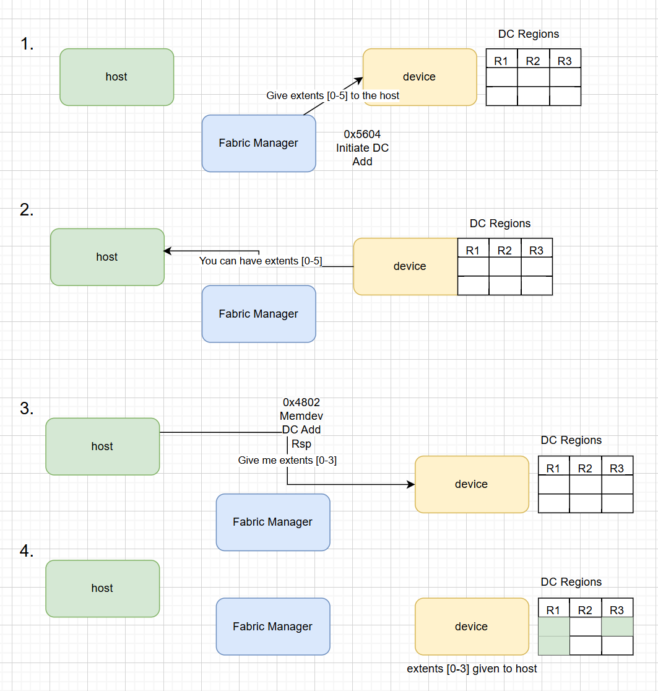
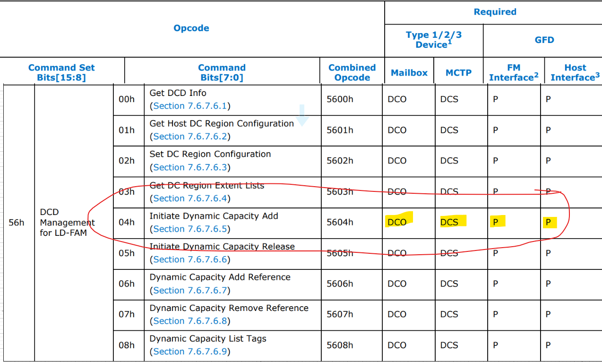
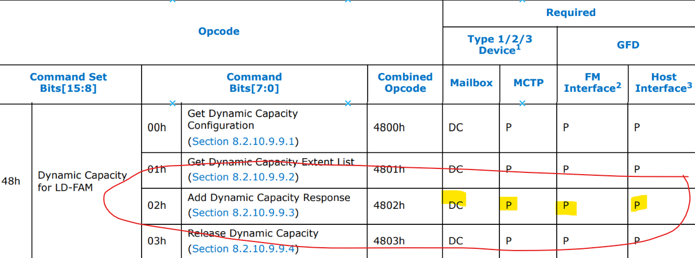
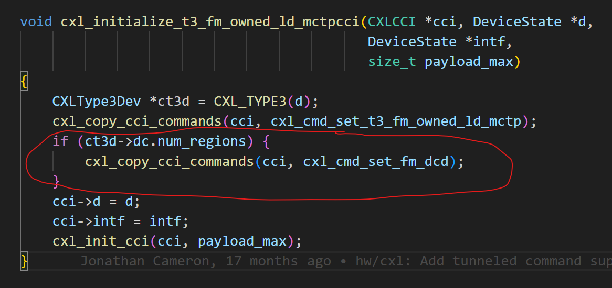
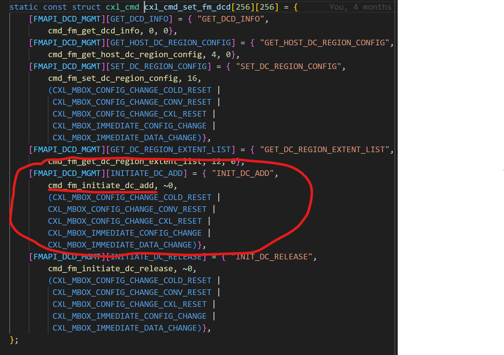
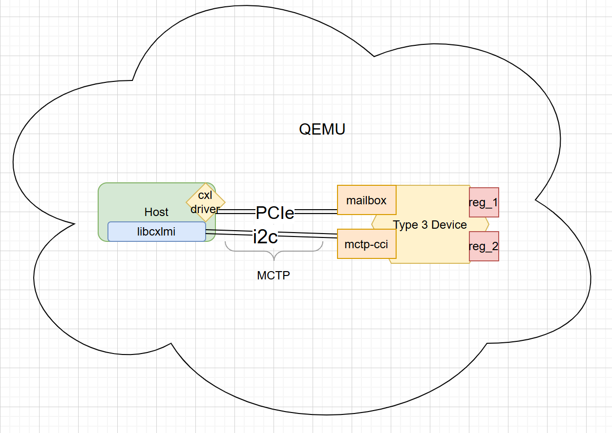
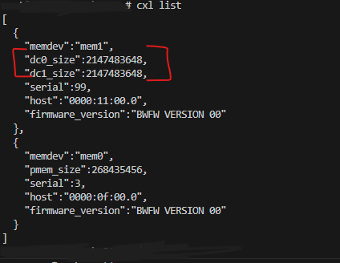
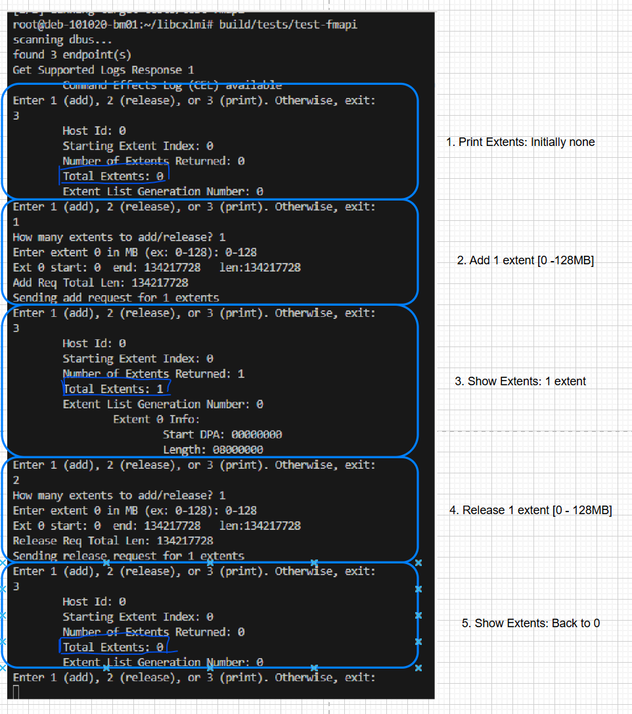
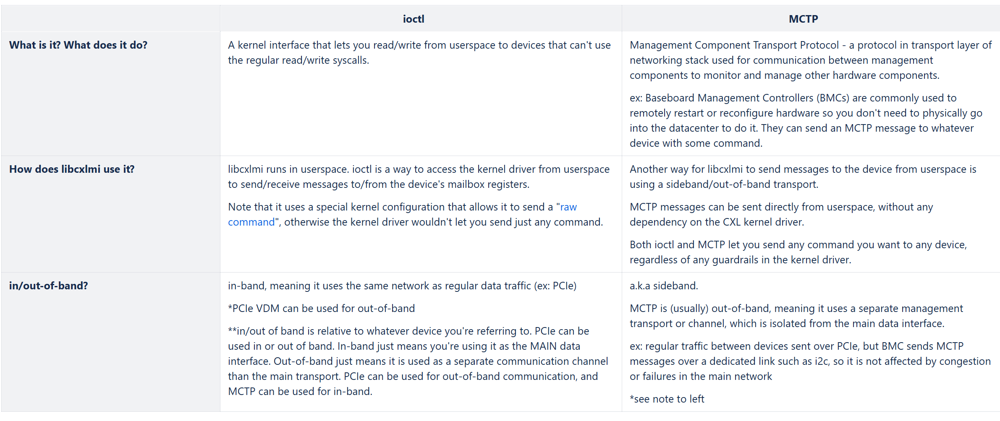

# How To Add a Command w/an Example
This page describes how to add a command to libcxlmi, implement it in QEMU, and
test both using 0x5604 FM Initiate Dynamic Capacity Add as an example.
Intended for those
new to CXL and interested in contributing to this library or QEMU or testing
QEMU using libcxlmi.

## Background
This section introduces the components involved in this command, how they talk to
each other, and the process of adding dynamic capacity to a host from a Dynamic
Capacity Device (DCD) that is owned by the Fabric Manager (FM).

### Command Workflow
Adding dynamic capacity with the Fabric Manager (FM) involves interaction
between the host, FM, and the device. This involves:

1. The Fabric Manager sends command 0x5604: FM Initiate DC Add
    - FM issues this command to the device, specifying some extents it wants the
    device to make available to the host
2. The device receives this command from the FM, processes the request, and
tells the host of the availability of those extents by recording the information
in an event log and triggering an interrupt to the host.
3. The host gets the notification and checks out the event log, then chooses
which extents it wants and sends it back to the device in command
0x4802 Memdev DC Add Rsp
4. The device receives this acknowledgement and allocates the accepted extents
to the host, completing this operation.

How does libcxlmi fit into this?

> libcxlmi will act as the FM, sending command 0x5604 to the device.

A detailed description of this workflow can be found in CXL r3.2 Section 7.6.7.6.5.

### Command Component Interface (CCI)
Now that we've established the role of the FM, device, and host in the process of
adding dynamic capacity to the host, we need to go over *how* they actually talk
to each other.
A CCI defines which commands a CXL device understands out of the entire set of
commands detailed in the spec because only certain devices implement certain
commands.

There are 2 types of CCIs: mailbox and MCTP-based, which just means there are 2
ways for a device to send and receive commands.
- The mailbox is just a special set of registers on the device that is part of CXL devices.
- MCTP is a special management protocol (way to send/receive messages) that
may or may not be supported depending on the hardware/firmware.

A device can implement multiple CCIs, meaning a device can receive some commands through the mailbox and a different set of commands through MCTP. The spec defines which commands can be received through which way in r3.2 Section 8.2.10 Component Command Interface.

#### Example 1: Command 0x5604
Looking at the table for command 0x5604, we see Mailbox is marked DCO, which means a DCD with a mailbox could include 0x5604 in its command set. MCTP is marked DCS, so a DCD that supports MCTP *must* be able to receive 0x5604 via MCTP.

> O = Optional, P = Prohibited, **DCO = Optional for DCDs**, **DCS = Mandatory for all DCDs that implement an MCTP-based CCI**,

#### Example 2: Command 0x4802
Now let's look at an example where a command is *prohibited* from being implemented
in a particular CCI. Command 0x4802 should *only* be implemented as part of the mailbox CCI according to the spec and is prohibited from being in the MCTP CCI.
Therefore, if you try to send this command via MCTP, the device won't be able to understand it.

> M = Mandatory; PM = Mandatory for devices that support persistence; **DC = mandatory for devices that support Dynamic Capacity;** O = Optional. **P = Prohibited.**

> Why is command 0x4802 prohibited from the MCTP CCI?

MCTP is typically used for out-of-band communication. Command 0x4802 should be
sent from the host to the device. It doesn't make sense for the host to use an out of band transport to communicate with the device. See more on [in v.s. out-of-band](#in-and-out-of-band)

## Adding a Command
There are 2 sides to adding this command:

In libcxlmi, we just need to define the request and response payload according to what the spec says and add send_cmd_xxx function.

The QEMU side is more involved. A short summary of what the device is supposed to do upon receiving command 0x5604 as covered in Step 2 of [Command Workflow](#command-workflow):
1. A bunch of sanity checks to see if the extents in the request are valid
    - There are multiple ways for the FM to select which extents we want the device to give to the host. Only the "prescriptive" selection policy is currently supported, which means sending an explicit list of extents with their starting device physical address (DPA) and length
2. Adding those extents to the "pending list" while we wait for the host to accept them
3. Creating an event record for this information, putting it in thee event log, and triggering an interrupt to the host

### libcxlmi Implementation:
The spec defines the request and response payload. Command 0x5604 only has a request payload and does not expect a response. Following how other commands are implemented:

#### Step 1: Define the Opcode
Opcodes are defined in an enum in *src/cxlmi/private.h*

#### Step 2: Define the Request/Response Payload
The request cxlmi_cmd_fmapi_initiate_dc_add_req is defined as a struct using the
offsets and member sizes set in the spec and added to *src/cxlmi/api-types.h*. Following the
implementation of previous commands, the "packed" attribute is used so the compiler
knows it's not allowed to add any padding between the fields.

#### Step 3. Implement the Command
All commands are implemented in *src/cxlmi/commands.c*. In QEMU, CXL devices are implemented to be little-endian, so conversion functions (cpu_to_le_16/32/64) must be used to send commands in the correct byte order. Similarly, to interpret responses correctly, the conversion fucntions le_16/32/64_to_cpu() need to be used.

### QEMU Implementation:
With the libcxlmi side done, the command handler needs to be added to QEMU so that the emulated device knows what to do when it receives command 0x5604. Follow the examples of previous commands in *hw/cxl/cxl-mailbox-utils.c*

#### Step 1. Implement Opcode Handler
The spec defines what the device does when it receives the command. To summarize:

In *hw/cxl/cxl-mailbox-utils.c*: the function **cmd_fm_initiate_dc_add** is implemented according to that, (ensure that extents are correctly aligned to the region, don't overlap, etc.). If the extents all look good, it will add them to a "pending list". These will be moved to the real "accepted" list once it receives acknowledgement from the host in the form of command 0x4802. To alert the host, the information is recorded in an event record and put it in the event log, then triggers an interrupt to the host.

#### Step 2. Add the Command to the Device's Command Set
In the previous [section on CCIs](#command-component-interface-cci), we
established that different devices support a different set of commands.

This is realized in QEMU via multiple **initialize_device_type_cci** functions,
which get called depending on what kind of device is being initialized.
This function copies the commands the device supports to its command set.

Which CCI does 0x5604 belong to?

This command is part of the FMAPI. From the [first example](#example-1), we see
the spec says that a DCD with MCTP support *must* support it and that it is
optional for the mailbox CCI.

Let's look at the function **cxl_intialize_t3_fm_owned_ld_mctpcci**, which
initializes the CCI of a Type3 Device that supports MCTP and is under the
management of an FM.

Notice the if statement checking if the device has a non-zero number of DC Regions.
If it does, meaning the device is a Dynamic Capacity Device, then the **cxl_cmd_set_fm_dcd** gets copied to the device's supported command set.

Therefore, let's add it to the **cxl_cmd_set_fm_dcd** table because it's mandatory
for MCTP DCDs and ignore the mailbox because it's optional.

## Testing
Now that the command is implemented, let's test the entire [workflow](#command-workflow)
of adding dynamic capacity.

### Configuration
Below is the "hardware" configuration we will use, but *everything is emulated in
QEMU*, so there aren't actually any special hardware requirements. At the time
of writing this page, not all CXL features are upstream in QEMU, so an [out-of-branch
QEMU version](https://gitlab.com/jic23/qemu/-/tree/cxl-2025-02-20) with more features is used:

- Host VM: the host VM is configured using [this kernel version](https://github.com/anisa-su993/anisa-linux-kernel/tree/mctp-hack) (also out-of-tree) because it includes 2 necessary features that are not upstream:
    - DCD support in the CXL driver – the kernel version linked above is based off [this branch](https://github.com/weiny2/linux-kernel/tree/dcd-v4-2024-12-11) that introduces DCD support
    - MCTP support – libcxlmi uses MCTP to send command 0x5604 to the device
    - the host sends command 0x4802 to the device's mailbox CCI over PCIe
- Dynamic Capacity Device (DCD)
    - Uses [this topology](https://github.com/moking/cxl-test-tool/blob/main/utils/cxl.py#L54): this topology actually includes a CXL PMEM device in addition to a DCD,
    but we're only going to be interacting with the DCD in this test
    - reg_1, reg_2: DC regions on the device
- libcxlmi: runs on the host and acts as the Fabric Manager (FM)
- i2c: the "physical" link over which libcxlmi sends MCTP messages

### Set Up QEMU
Start a QEMU instance with the above topology. For users new to using QEMU to
emulate CXL topologies, a good tool to use is [cxl-test-tool](https://github.com/moking/cxl-test-tool). Please read the required steps for setting that up there.

If using cxl-test-tool, after configuring it:
- Start a QEMU instance with the above topology:
`cxl-test-tool --run -T FM_DCD`
- Load the kernel CXL Driver Modules
`cxl-test-tool --load-drv`
- Verify Topology:
    - login to the VM: `cxl-test-tool --login`
    - Run command: `cxl list`
    - Verify that you have a DCD. One of the devices listed should have "dc#_size:",
    which shows the size of the DC region(s) on the device.

    
    - log back out of the VM: `exit`
- Create a DC Region: `cxl-test-tool --create-dcR [memdev name]`
    - You can get the memdev name from the output of the `cxl list` command
    - In the example above, the DCD is called "mem1", but this can differ.
- Set up MCTP: `cxl-test-tool --setup-mctp`

Now everything is set up to test the command.

### Test Adding Dynamic Capacity
This portion uses the program `examples/fmapi-mctp.c` to send command 0x5604 and allow us
to see the entire FM-initiated add/release workflow.

This program lets you add (0x5604 FM Initiate DC Add),release (0x5605 FM Initiate DC Release), or print (0x5603 FM Get DC Region Extent List) extents.

Here is some example output:

Run this program on the host VM created with the correct topology by cloning
libcxlmi on it.

#### Troubleshooting:
> I sent the add/release command, but the extent list is always empty when printed?

Note that the FM Init Add/Release commands do not directly add or release extents
on the device. The device must first alert the host about it and receive acknowledgement.
If your kernel version does not have DCD support, the host won't be able to understand
the device's alert or send acknowledgement, so the add/release capacity operation
cannot be completed.

## Additional Background:
### In and Out of Band:
From the main README:
> `libcxlmi` aims to be a CXL swiss army knife to interact with CXL component(s)
through CCI command(s), both in and out of band transports.

This section goes over the 2 ways libcxlmi talks to the device: `ioctl` or MCTP
and about the differences of in/out of band transports.

